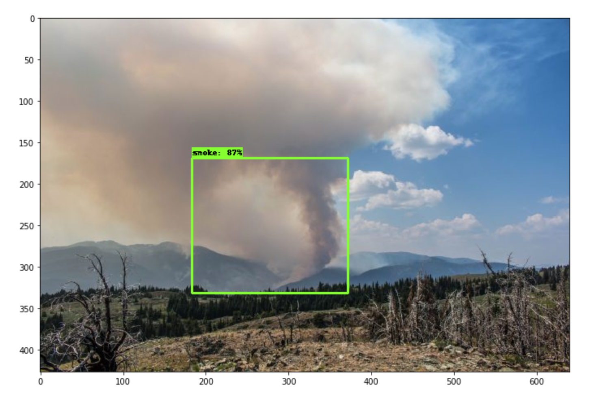
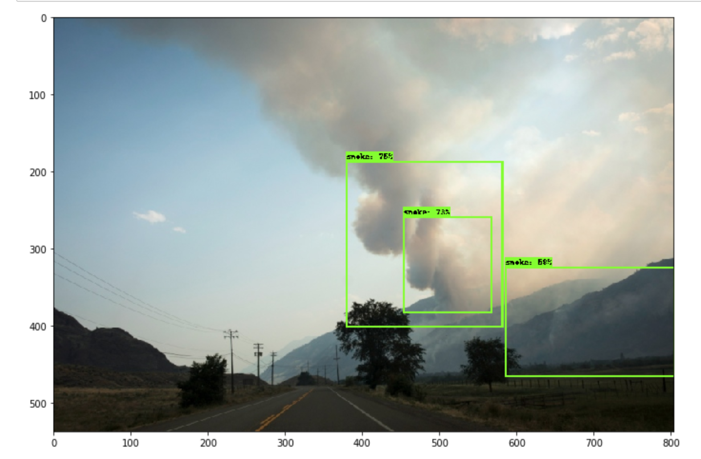
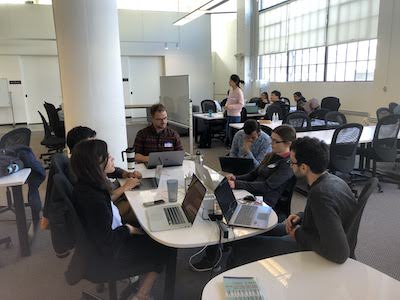

# Lets Stop Wildfires Hackathon 2.0

## OFFICIAL LAUNCH DATE: JUNE 20, 2020

## GOAL: Build Deployable Wildfire Smoke Detection Models for HPWREN Cameras

## REGISTER [HERE](https://forms.gle/wM7zRPFMUQptpygX9) 

**Lets Stop Wildfires Hackathon 2.0** is a reboot of the last successful [wildfires hackathon](https://aiformankind.org/lets-stop-wildfires-hackathon) organized by [AI For Mankind](https://aiformankind.org). 

In the last Lets Stop Wildfires Hackathon which was launched in 2019, we focused on classification of smoke on the whole image or gridded image. In this hackathon, we want to formulate the problem as smoke detection and segmentation. We present the following challenges for our participants to solve. Special thanks to [HPWREN](http://hpwren.ucsd.edu/) to provide access to HPWREN camera images.

1. Detect Wildfire Smoke using Bounding Boxes
2. Detect Wildfire Smoke using Segmentation Masks
3. Bonus: Detect Wildfire Smoke using Temporal Sequences.

Do you know there are many cameras installed around mountaintop in California. These are the HPWREN and AlertWildfire cameras.

- [HPWREN Cameras](http://hpwren.ucsd.edu/cameras/I/wc-e-mobo-c.html)

- [AlertWildfire Cameras](http://www.alertwildfire.org/southeastbay/index.html?v=518dd6a)

**Can your wildfire detector beat the "AI For Mankind: SUPER DUPER WILDFIRE SMOKE DETECTOR" ?** 

### GET STARTED 
While waiting for the official release of annotated dataset, you can checkout our quick start repo for building a wildfire smoke detector. It comes with a docker image and sample dataset to get you started.

1. [Wildfire Smoke Detector](https://github.com/aiformankind/wildfire-smoke-detection-camera)

### Other Useful Resources
1. [Google Colaboratory to develop deep learning application on free GPU](https://colab.research.google.com)

2. [Wildfire Smoke Classifier using Google Colab](https://github.com/aiformankind/lets-stop-wildfires-hackathon/blob/master/Challenge_1A_WildfireSmokeImageClassifierForDemo.ipynb)

3. [FUEGO firecam repo](https://github.com/fuego-dev/firecam)

See some sample HPWREN pictures below.

 

We believe that open sharing and collaboration are important in accelerating innovation and driving meaningful change locally and globally. Public and private partnerships coupled with citizen participation can help win the fight against wildfires. 

Everything built during the hackathon will remain as open source with The MIT license. 

Our [previous hackathon](https://aiformankind.org/lets-stop-wildfires-hackathon) was a success. Participants engaged in discussions shown in pics below.

 

**Note: If you wish to keep your idea/project private, please do not enter this hackathon.**

#### Contact Us
If you have any questions, please feel free to

Email us at [ai.for.mankind@gmail.com](ai.for.mankind@gmail.com) or

Join us on **Slack** at [https://tinyurl.com/vepdjpf](https://tinyurl.com/vepdjpf)

By participating in this hackathon, participants agree to be bound by all of the terms and conditions as set out below.

**You have to register [HERE](https://forms.gle/Rtedxr1rT9HHJogm6) to participate in the hackathon. Last day to register is Aug 2, 2020.**

#### Eligibility

1. This hackathon is open to everyone at least 16 years old.

#### Hackathon Period
The hackathon starts on Saturday June 20, 2020 at 9AM PT and ends on Sunday Aug 23, 2020 at 11:59PM PT. 

Note: Hackathon end dates are at the sole discretion of AI For Mankind and may be subject to change.

#### Requirements
1. Teams must be comprised of 1-5 people.

2. You have to create a public github repository for your entry with the MIT License.

3. Participants are not allowed to enter in projects containing confidential information or subject to the proprietary rights of any person or entity.

#### How Will My Entry be Potentially Used?

By participating in the hackathon, you agree to ALL of the following statements:

1. You understand and acknowledge that your entry/submission in their entirety will become open source (MIT License) and made publicly available to everyone. You agree to make any code produced/submitted for the hackathon (your entry’s github repository) available under the terms of The MIT License and other created works under the terms of the CC BY-SA 4.0 licence. **Participant hereby irrevocably licenses all Work Product under the MIT License located at https://opensource.org/licenses/MIT.** "Work Product" means all ideas, concepts, proposals, materials, and all other work product of any nature whatsoever, that are created, prepared, produced, conceived, or reduced to practice by Participant solely or jointly with others during the Hackathon. Participant represents and warrants that, to the best of his or her knowledge, the Work Product is and will be Participant’s own original work and does not and will not infringe the intellectual property or proprietary rights of any third party, including, without limitation, any third party patents, copyrights or trademarks.

2. You understand and acknowledge that after the submission deadline has passed, your project (github repository) that has been submitted to the hackathon cannot be deleted or made private.  Your project repository will also be featured on the AI For Mankind Let's Stop Wildfires hackathon github page after the hackathon has concluded.
3. You understand and acknowledge that others may have developed or commissioned materials similar or identical to your entry and you waive any claims you may have resulting from any similarities to your entry.
4. You understand that you will not receive any compensation for use of your entry.
 
Note: If you do not agree to above and want to keep your idea/project private, please do not enter this hackathon.

#### Rules of Conduct
1. Respect each other.
2. Do not violate copyrights, trademarks, or other such rights.
3. Observe data protection legislation.

Note: Teams can be disqualified from the competition at the organizer's discretion. Reasons might include but are not limited to breaking the Hackathon Rules or other unsporting behavior.

#### References
1. [The MIT License](https://opensource.org/licenses/MIT)
2. [CC BY-SA 4.0 Licence](https://creativecommons.org/licenses/by/4.0/)

#### Mentors for Hackathon

#### Collaborators
HPWREN

#### Sponsors
Stay Tuned

#### Prize Money
Stay Tuned

#### Wildfire Resources
1. [FUEGO Wildfire Detection Slides by Kinshuk Govil](https://tinyurl.com/rbrn4oq)
2. [A Review on Forest Fire Detection Techniques](https://journals.sagepub.com/doi/pdf/10.1155/2014/597368)
3. [Wildland Fire Assessment System](http://www.wfas.net/)
4. [The United States Fourth National Climate Assessment Volume II](https://nca2018.globalchange.gov/downloads/NCA4_Report-in-Brief.pdf)
5. [How Wildfire Works](https://science.howstuffworks.com/nature/natural-disasters/wildfire.htm/printable)
6. [Fighting Wildfires](https://mentalfloss.com/article/57094/10-strategies-fighting-wildfires)
7. [Wildland Fire: What is Hazard Fuel Reduction?](https://www.nps.gov/articles/what-is-hazard-fuel-reduction.htm)

#### Tensorflow Resources
1. [Tensorflow Quickstart](https://www.tensorflow.org/tutorials/quickstart/beginner)
2. [Tensorflow Tutorials](https://www.tensorflow.org/tutorials)
3. [Install Tensorflow in PyCharm](https://youtu.be/vEXCMOuPB3c)
4. [What is transfer learning? Exploring the popular deep learning approach](https://builtin.com/data-science/transfer-learning) 
5. [Transfer learning in TensorFlow 2 tutorial](https://adventuresinmachinelearning.com/transfer-learning-tensorflow-2/)
6. [Deep learning unbalanced training data](https://towardsdatascience.com/deep-learning-unbalanced-training-data-solve-it-like-this-6c528e9efea6)

#### Papers
1. [Do Better ImageNet Models Transfer Better?](https://www.zpascal.net/cvpr2019/Kornblith_Do_Better_ImageNet_Models_Transfer_Better_CVPR_2019_paper.pdf)
2. [SpotTune: Transfer Learning through Adaptive Fine-tuning](http://openaccess.thecvf.com/content_CVPR_2019/papers/Guo_SpotTune_Transfer_Learning_Through_Adaptive_Fine-Tuning_CVPR_2019_paper.pdf)
3. [Taskonomy: Disentangling Task Transfer Learning](http://openaccess.thecvf.com/content_cvpr_2018/papers/Zamir_Taskonomy_Disentangling_Task_CVPR_2018_paper.pdf)

#### Upcoming Events

