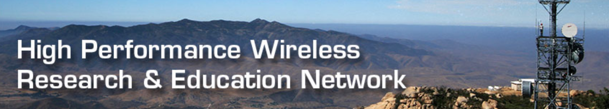
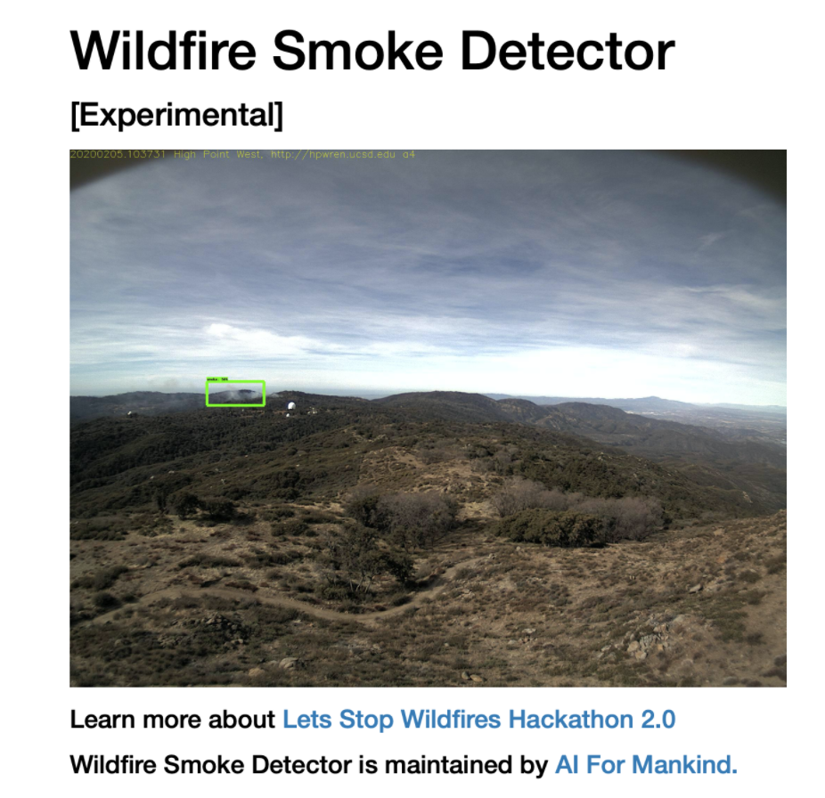
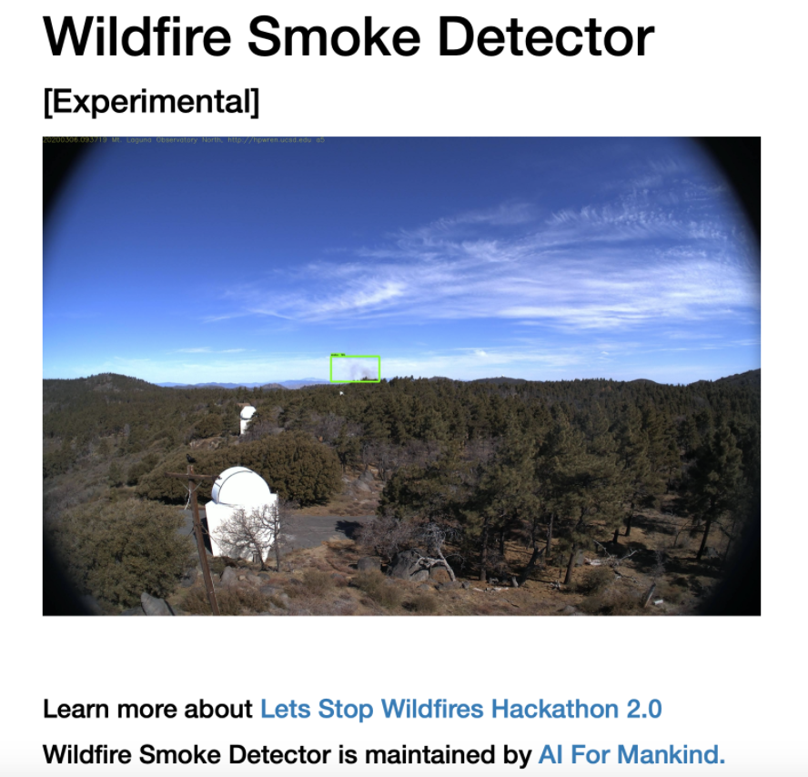

# Lets Stop Wildfires Hackathon 2.0

## GOAL: Build Deployable Wildfire Smoke Detection Models for HPWREN Cameras

## REGISTER [NOW](https://forms.gle/wM7zRPFMUQptpygX9) 

**Lets Stop Wildfires Hackathon 2.0** is a reboot of the last successful [wildfires hackathon](https://aiformankind.org/lets-stop-wildfires-hackathon) organized by [AI For Mankind](https://aiformankind.org). 

In the last Lets Stop Wildfires Hackathon which was launched in 2019, we focused on classification of smoke on the whole image or gridded image. In this hackathon, we want to formulate the problem as smoke detection and segmentation. We present the following challenges for our participants to solve. Special thanks to [High Performance Wireless Research and Education Network (HPWREN)](http://hpwren.ucsd.edu/) to provide access to HPWREN camera images.

1. Detect Wildfire Smoke using Bounding Boxes
2. Detect Wildfire Smoke using Segmentation Masks
3. Bonus: Detect Wildfire Smoke using Temporal Sequences.
4. Bonus: Real Time On Device Wildfire Smoke Detector.

Do you know there are many cameras installed around mountaintop in California. These are the HPWREN and AlertWildfire cameras.

- [HPWREN Cameras](http://hpwren.ucsd.edu/cameras/I/wc-e-mobo-c.html)

- [AlertWildfire Cameras](http://www.alertwildfire.org/southeastbay/index.html?v=518dd6a)

**We believe that open sharing and collaboration are important in accelerating innovation and driving meaningful change locally and globally. Public and private partnerships coupled with citizen participation can help win the fight against wildfires.**

Everything built during the hackathon will remain as open source with The MIT license. 

## Our Collaborators
[High Performance Wireless Research and Education Network (HPWREN)](http://hpwren.ucsd.edu/)

The High Performance Wireless Research and Education Network (HPWREN), a University of California San Diego partnership project led by the San Diego Supercomputer Center and the Scripps Institution of Oceanography's Institute of Geophysics and Planetary Physics, supports Internet-data applications in the research, education, and public safety realms.

 

## AI For Mankind's Wildfire Smoke Detector
**Can your wildfire smoke detector beat the "AI For Mankind: SUPER DUPER WILDFIRE SMOKE DETECTOR" ?** We need your help and expertise in building a better and improved wildfire smoke detector.

AI For Mankind had annotated 744 wildfire smoke [HPWREN](http://hpwren.ucsd.edu/) images in 2019 and built a wildfire smoke detector using the annotated images. It has shown promising results running against wildfire images captured by HPWREN in 2020. See our wildfire smoke detector results below.

1. 2020-02-05 fire captured by HPWREN camera hp-w-mobo-c, smoke detected *13 minutes* after fire ignition.
 

 

2. 2020-03-06 fire captured by HPWREN camera mlo-n-mobo-c, smoke detected *3 minutes* after fire ignition.
 

 

3. 2020-05-21 fire captured by HPWREN camera VEGMGMT ml-w-mobo-c, smoke detected *16 minutes* after fire ignition.
 

 

In this hackathon, we provide our wildfire smoke detector repo with the same annotated images to get you started and challenge you all to build a better and improved model to beat our detector. 

 

### GET STARTED 
You can checkout our wildfire smoke detector repo below. It comes with a docker image and annotated [HPWREN](http://hpwren.ucsd.edu/) images to get you started.

1. [Wildfire Smoke Detector Quickstart Repo](https://github.com/aiformankind/wildfire-smoke-detection-camera). Follow the steps to build a simple wildfire smoke detector.

### DATASET
In the above repo, you will find 744 bounding box annotated [HPWREN](http://hpwren.ucsd.edu/) wildfire smoke images.

3292 Total Number of Images, 744 of them are annotated with [bounding boxes.](https://github.com/aiformankind/wildfire-smoke-detection-camera/tree/master/input/images)

PASCAL VOC [Annotations](https://github.com/aiformankind/wildfire-smoke-detection-camera/tree/master/input/annotations/xmls)

**Note: We will release a bigger official dataset on JUNE 20, 2020.**

### Other Useful Resources
1. [Colab Notebook for developing deep learning application on free GPU](https://colab.research.google.com)
2. [Colab Notebook for Image Segmentation](https://keras.io/examples/vision/oxford_pets_image_segmentation/)
3. [Wildfire Smoke Classifier using Google Colab](https://github.com/aiformankind/lets-stop-wildfires-hackathon/blob/master/Challenge_1A_WildfireSmokeImageClassifierForDemo.ipynb)

4. [FUEGO firecam repo](https://github.com/fuego-dev/firecam)

See some sample HPWREN pictures below. Can you detect the smoke ?

 

### How Challenging to Detect Wildfire Smoke
It is very challenging to detect these wildfire smokes. See the following HPWREN examples.

#### [See this far away smoke video](videos/far_away_smoke.mov)

Can you see the smoke in the following images ?

Our [previous hackathon](https://aiformankind.org/lets-stop-wildfires-hackathon) was a success. Participants engaged in discussions shown in pics below.

 

## Mentors for Hackathon
1. [Adam Kraft](https://www.linkedin.com/in/adam-kraft-7555b534/) Machine Learning Engineer from Google Brain
2. [Jianming Zhang](https://www.linkedin.com/in/jianming-zhang-60762227/), Senior Research Scientist from Adobe Research
3. [Vladimir Iglovikov](https://www.linkedin.com/in/iglovikov/) Kaggle Grandmaster, Senior Computer Vision Engineer at Level5, Self-Driving Division, Lyft Inc.

**Note: If you wish to keep your idea/project private, please do not enter this hackathon.**

## Contact Us
If you have any questions, please feel free to email us at [ai.for.mankind@gmail.com](ai.for.mankind@gmail.com)

## Join Our Slack Channel
- [AI For Mankind Slack Channel](https://tinyurl.com/vch2z68)

## Join Our Meetup Group
- [Join AI For Mankind Meetup Group](https://www.meetup.com/AI-for-Mankind/) to receive event announcement.

**By participating in this hackathon, participants agree to be bound by all of the terms and conditions as set out below.**

**You have to register [HERE](https://forms.gle/Rtedxr1rT9HHJogm6) to participate in the hackathon. Last day to register is Aug 2, 2020.**

#### Eligibility

1. This hackathon is open to everyone at least 18 years old. If you are in high school and would like to participate, you will be paired with another participant who will serve as a mentor.

#### Hackathon Period
The hackathon starts on **Saturday June 20, 2020 at 9AM PT and ends on Sunday Aug 23, 2020 at 11:59PM PT**. 

Note: Hackathon end dates are at the sole discretion of AI For Mankind and may be subject to change.

#### Requirements
1. Teams must be comprised of 1-5 people.

2. You have to create a public github repository for your entry with the MIT License.

3. Participants are not allowed to enter in projects containing confidential information or subject to the proprietary rights of any person or entity.

#### How Will My Entry be Potentially Used?

By participating in the hackathon, you agree to ALL of the following statements:

1. You understand and acknowledge that your entry/submission in their entirety will become open source (MIT License) and made publicly available to everyone. You agree to make any code produced/submitted for the hackathon (your entry’s github repository) available under the terms of The MIT License and other created works under the terms of the CC BY-SA 4.0 licence. **Participant hereby irrevocably licenses all Work Product under the MIT License located at https://opensource.org/licenses/MIT.** "Work Product" means all ideas, concepts, proposals, materials, and all other work product of any nature whatsoever, that are created, prepared, produced, conceived, or reduced to practice by Participant solely or jointly with others during the Hackathon. Participant represents and warrants that, to the best of his or her knowledge, the Work Product is and will be Participant’s own original work and does not and will not infringe the intellectual property or proprietary rights of any third party, including, without limitation, any third party patents, copyrights or trademarks.

2. You understand and acknowledge that after the submission deadline has passed, your project (github repository) that has been submitted to the hackathon cannot be deleted or made private.  Your project repository will also be featured on the AI For Mankind Let's Stop Wildfires hackathon 2.0 github page after the hackathon has concluded.
3. You understand and acknowledge that others may have developed or commissioned materials similar or identical to your entry and you waive any claims you may have resulting from any similarities to your entry.
4. You understand that you will not receive any compensation for use of your entry.
 
Note: If you do not agree to above and want to keep your idea/project private, please do not enter this hackathon.

#### Rules of Conduct
1. Respect each other.
2. Do not violate copyrights, trademarks, or other such rights.
3. Observe data protection legislation.

Note: Teams can be disqualified from the competition at the organizer's discretion. Reasons might include but are not limited to breaking the Hackathon Rules or other unsporting behavior.

#### References
1. [The MIT License](https://opensource.org/licenses/MIT)
2. [CC BY-SA 4.0 Licence](https://creativecommons.org/licenses/by/4.0/)

#### Sponsors
Stay Tuned

[Reach out to us](https://forms.gle/ZZZbxTmYpFoHheb7A) if you are interested in sponsoring the hackathon.

#### Prize Money
Stay Tuned

Donate to the prize money. Your tax-deductible [donation](https://donorbox.org/donate-to-ai-for-mankind?default_interval=o) today will help support our mission.

AI For Mankind is a 501(c)(3) nonprofit organization. EIN 84-1750651

#### Wildfire Resources
1. [FUEGO Wildfire Detection Slides by Kinshuk Govil](https://tinyurl.com/rbrn4oq)
2. [A Review on Forest Fire Detection Techniques](https://journals.sagepub.com/doi/pdf/10.1155/2014/597368)
3. [Wildland Fire Assessment System](http://www.wfas.net/)
4. [The United States Fourth National Climate Assessment Volume II](https://nca2018.globalchange.gov/downloads/NCA4_Report-in-Brief.pdf)
5. [How Wildfire Works](https://science.howstuffworks.com/nature/natural-disasters/wildfire.htm/printable)
6. [Fighting Wildfires](https://mentalfloss.com/article/57094/10-strategies-fighting-wildfires)
7. [Wildland Fire: What is Hazard Fuel Reduction?](https://www.nps.gov/articles/what-is-hazard-fuel-reduction.htm)

#### Tensorflow Resources
1. [Tensorflow Quickstart](https://www.tensorflow.org/tutorials/quickstart/beginner)
2. [Tensorflow Tutorials](https://www.tensorflow.org/tutorials)
3. [Install Tensorflow in PyCharm](https://youtu.be/vEXCMOuPB3c)
4. [What is transfer learning? Exploring the popular deep learning approach](https://builtin.com/data-science/transfer-learning) 
5. [Transfer learning in TensorFlow 2 tutorial](https://adventuresinmachinelearning.com/transfer-learning-tensorflow-2/)
6. [Deep learning unbalanced training data](https://towardsdatascience.com/deep-learning-unbalanced-training-data-solve-it-like-this-6c528e9efea6)

#### Papers
1. [Do Better ImageNet Models Transfer Better?](https://www.zpascal.net/cvpr2019/Kornblith_Do_Better_ImageNet_Models_Transfer_Better_CVPR_2019_paper.pdf)
2. [SpotTune: Transfer Learning through Adaptive Fine-tuning](http://openaccess.thecvf.com/content_CVPR_2019/papers/Guo_SpotTune_Transfer_Learning_Through_Adaptive_Fine-Tuning_CVPR_2019_paper.pdf)
3. [Taskonomy: Disentangling Task Transfer Learning](http://openaccess.thecvf.com/content_cvpr_2018/papers/Zamir_Taskonomy_Disentangling_Task_CVPR_2018_paper.pdf)

#### Upcoming Events

[Lets Annotate Wildfire Smoke Images on Saturday, May 30 at 10 am Pacific Time](https://www.meetup.com/AI-for-Mankind/events/270718685/)
